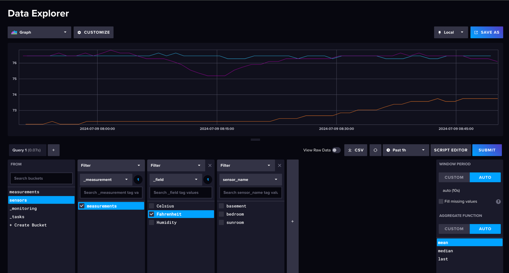
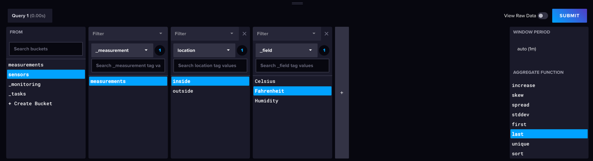
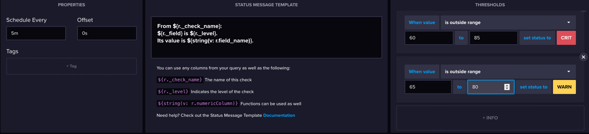
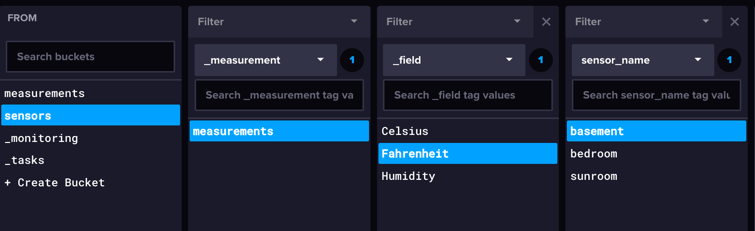
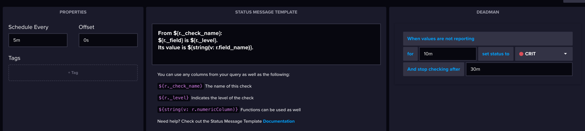
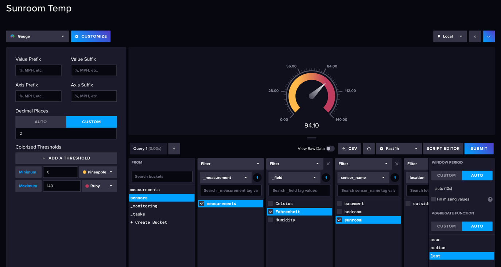
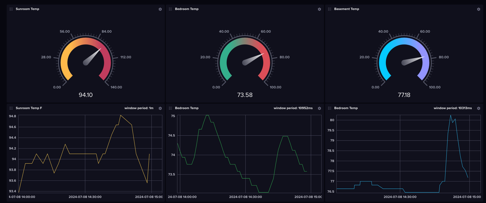

# Measuring IoT and Setting Alerts Using AWS and Influxdb

### Hardware

- ESP8266-based board (or some other appropriate Arduino-based board).
  - Tested with WEMOS D1 Mini.
- DHT sensors.
  - Tested with DHT22
- Three micro usb chargers

### AWS Infrastructure Setup

- You must have an AWS account with necessary privileges (https://docs.aws.amazon.com/accounts/latest/reference/welcome-first-time-user.html)
- Create an IAM user and configure the aws cli (https://docs.aws.amazon.com/cli/v1/userguide/cli-authentication-user.html)
- Create a key pair for your ec2 instance (https://docs.aws.amazon.com/AWSEC2/latest/UserGuide/create-key-pairs.html)
- Run `cp terraform/terraform.tfvar.bak terraform/terraform.tfvars` and add your current ip address
  - This only allows you to ssh into your instance from you current ip. 
  - If you want to be able to ssh into the instance from anywhere change `cidr_blocks = ["${var.home_ip}/32"]` to `cidr_blocks = ["0.0.0.0/0"]` in terraform/main.tf
- Install terraform (https://developer.hashicorp.com/terraform/tutorials/aws-get-started/install-cli)
- Run `cd terraform` > `terraform apply`
- This will output an eip and public_dns
- Copy these values along with the key pair you created to ansible/inventory.txt

### Software and Sensor Setup

- Install ansible (https://docs.ansible.com/ansible/latest/installation_guide/intro_installation.html)
- cd into the ansible directory
- Run `ansible-playbook -i inventory playbook.yml`
- Install Arduino IDE (https://www.arduino.cc/en/software)
- Open Influx UI at https://{{ ec2_public_ip }}.sslip.io
- Create an admin user, project, and 'sensors' bucket 
  - Click on Arduino > Next > ESP8266 > Install necessary libraries in the Arduino IDE > Select 'sensors' bucket 
  - Run `cp arduino/src/config.default.h arduino/src/config.h`
  - Copy the four lines starting with `#define INFLUXDB_URL` from **Configure an InfluxDB profile** to arduino/src/config.h
  - Fill in WIFI_SSID and WIFI_PASSWORD for your network in arduino/src/config.h
  - Change TZ_INFO to your time zone (Google "What is my timezone?")
  - Change SENSOR_NAME to desired value (this value must be changed for each sensor)
  - Change or add tags as needed (ex. LOCATION)
  - Upload sketch to your esp8266 board (Data wire is coded to D5, minus goes to GRND, and + to 3v3, open the serial monitor at 9600 baud)
- Cofirm data is being sent in the Data Explorer Dashboard

  

###  Setup Alerts and Notifications

- Create a threshold and deadman check for each sensor or location (https://docs.influxdata.com/influxdb/v2/monitor-alert/#create-an-alert)
  
  Define Query: 

  

  Configure Check:

  

  Deadman:

  

  

- Clone the checks for each of your sensors
- Send an alert email (https://docs.influxdata.com/influxdb/v2/monitor-alert/send-email/c)

###  Setup Dashboard (https://docs.influxdata.com/influxdb/v2/visualize-data/dashboards/create-dashboard/)

- Configure each cell of the dashboard for a different table as below

  
### License

GNU General Public License version 3 (GPLv3).